<div align="center">



</div>

---

## `~/thavasix-gr8 $ whoami`

> Someone who believes in **unlearning and relearning** —
> constantly evolving, experimenting, and figuring things out along the way.

---

## `~/thavasix-gr8 $ cat current_status.log`

| | |
|---|---|
| 🟢 Exploring ideas & building | 🟢 Learning by iteration |
| ⚪ What comes next... | ⚪ Still figuring it out |

---

## `~/thavasix-gr8 $ cat tools.conf`

```yaml
philosophy: "use whatever fits the problem"
focus:
  - development
  - real-world problem solving
approach: pragmatic
status: always_learning
```

---

## `~/thavasix-gr8 $ cat open_to.txt`

| TYPE | STATUS |
|------|--------|
| Collaboration | `OPEN` |
| Learning Opportunities | `OPEN` |
| Meaningful Discussions | `OPEN` |

---

<div align="center">

```
╔══════════════════════════════════════════╗
║  still learning. still building.         ║
║  still figuring things out.              ║
╚══════════════════════════════════════════╝
```


</div>
